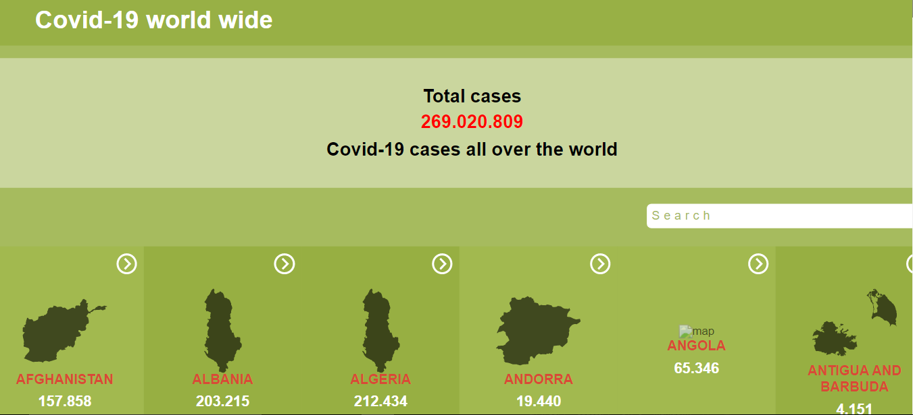
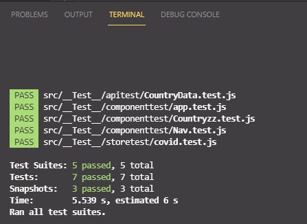

# Covid-19 World Wide

This project provides all information numerically in each country, the first-page displays all the countries, when you click on one country the other page with country info will display. the page also includes a search where you can search by country name.
Countries and details are gotten and stored in the API.
> 

# BUILT WITH

- 
- 
- 
- 
- 
- 
- 
- 
- 
- 

> 

# PREVIEW
> [LIVE PREVIEW](https://tender-villani-ef3251.netlify.app)

> [Loom video](https://www.loom.com/share/a664c4e16b524c4aa770a8f24b9ab922)

### Prerequisites
npm/yarn installed

### Setup-react
clone the repo: git clone git@github.com:https://github.com/Mucyosoda/covid-19-world-wide.git
jump to the active branch: git checkout covid-19-info

### Install
- in the terminal, run: npm installor npm i
# Usage
- now run npm start to start the app
# Run tests
- Author only
# Deployment
- This project was deployed on Netlify 

## Authors

👤 **Mucyo Claude**
- GitHub: [@Mucyosoda](https://github.com/Mucyosoda)
- Twitter: [@mucyoclaude1](https://twitter.com/Mucyoclaude1)
- LinkedIn: [LinkedIn](https://www.linkedin.com/in/claudemucyo)

## 🤝 Contributing

Contributions, issues, and feature requests are welcome!

Feel free to check the [issues page](../../issues/).
## Show your support
Give a ⭐️ if you like this project!

## Acknowledgments

- Thanks to Nelson Sakwa The owner original design idea 
- Thanks to microverse

## 📝 License

This project is [MIT](./LICENSE.md) licensed.
